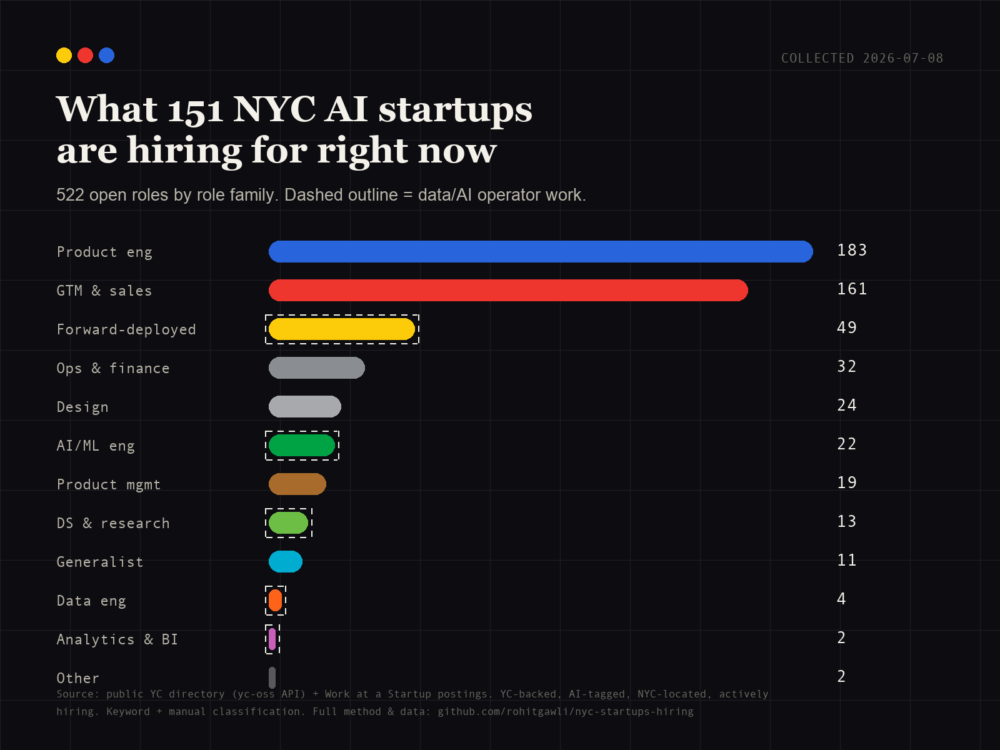

# NYC AI Startup Hiring Signal Atlas

**The Hiring Signal** is an open-source data artifact answering one question:

> What are early-stage AI startups in NYC actually hiring for?

It combines a reproducible Python pipeline with a polished React/D3 scrollytelling site and public-share cards.


## Headline

I analyzed `522` public job postings from `151` YC-backed, AI-tagged startups with New York location metadata.

The interesting signal: the work is less "AI strategy" and more operating-system plumbing — product engineering, GTM, forward-deployed implementation, evals, infrastructure, reporting, and customer workflows.

Role-family snapshot:

- `183` product engineering roles
- `161` GTM / sales / customer-success roles
- `49` forward-deployed / solutions roles
- `22` AI / ML engineering roles
- `4` data engineering roles
- `2` analytics / BI roles

Static chart for Reddit/social:



## What Ships

- `pipeline/`: collection, cleaning, classification, atlas build, share-card export.
- `data/processed/companies.csv`: company-level metadata.
- `data/processed/jobs.csv`: deduped job records with derived classifications and source URLs.
- `data/processed/atlas.json`: site-ready payload.
- `data/processed/target_roles.csv`: Rohit-fit shortlist for applications/outreach.
- `site/`: Vite + React + D3 scrollytelling artifact.
- `outputs/report.md`: narrative, LinkedIn/X/Reddit drafts, and QA notes.
- `methodology.md`: inclusion rules, taxonomy, caveats, reproducibility.

Raw job-description text and raw source responses are gitignored; the public repo ships derived labels, counts, titles, and source URLs.

## Reproduce The Pipeline

```bash
python3 -m pip install -r requirements.txt

python3 pipeline/collect_yc.py
python3 pipeline/collect_jobs.py
python3 pipeline/classify.py
python3 pipeline/build_atlas.py
python3 pipeline/export_share_cards.py
```

Optional LLM classification (GLM 5.2 via Z.ai):

```bash
cp .env.example .env
# Edit .env and set ZAI_API_KEY=your-key-here
python3 pipeline/classify.py
```

The pipeline loads `.env` from the repo root automatically. It accepts `ZAI_API_KEY`, `GLM_API_KEY`, or `OPENAI_API_KEY`. Defaults: model `glm-5.2`, base URL `https://api.z.ai/api/paas/v4`.

Without an API key, the published pipeline still runs with deterministic keyword rules plus checked manual overrides in `pipeline/manual_overrides.json`.

## Run The Site

```bash
cd site
npm install
npm run dev
```

Build for publishing:

```bash
cd site
npm run build
```

The site copies `data/processed/atlas.json` into `site/src/data/atlas.json` before dev/build.

## Data Dictionary

Company fields include:

- `company_id`
- `company_name`
- `slug`
- `website`
- `source_url`
- `nyc_presence`
- `yc_batch`
- `batch_year`
- `industry_tags`
- `ai_category`
- `estimated_stage`
- `team_size_text`
- `hiring_status`

Job fields include:

- `job_id`
- `company_id`
- `company_name`
- `job_title`
- `job_url`
- `source`
- `location_text`
- `remote_policy`
- `nyc_relevance`
- `seniority`
- `role_family`
- `operator_need_tags`
- `ai_surface_tags`
- `leadership_flag`
- `operator_adjacent`
- `classification_method`
- `classification_confidence`
- `manual_review_flag`

## Methodology Caveats

This is a YC-heavy snapshot, not a census of the NYC AI market. Public job postings are marketing documents, location fields are messy, and keyword rules can over-tag broad descriptions. Treat the numbers as a directional signal from this sample on the collection date, not as a labor-market statistic.

Full methodology: [`methodology.md`](methodology.md)

## License

MIT. See [`LICENSE`](LICENSE).
